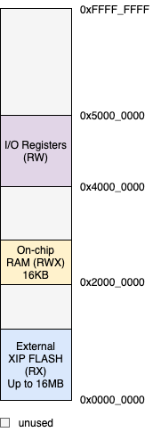

# Chameleon SoC (IBEX)
AHB-Lite based SoC for IBEX

## The Memory Map

## Peripherals
|Peripheral|Bus|Base Address|IRQ #|MPRJ I/O Pins|
|----------|---|------------|--------|-----|
|GPIO (14)|AHB|0x48000000|N/A|0-13|
|UART0|APB|0x40000000|16|20-21|
|UART1|APB|0x40100000|17|22-23|
|SPI0|APB|0x40200000|18|24-27|
|SPI1|APB|0x40300000|19|28-31|
|I2C0|APB|0x40400000|20|32-33|
|I2C1|APB|0x40500000|21|34-35|
|PWM0|APB|0x40600000|n/a|26|
|PWM1|APB|0x40700000|n/a|37|
|TMR0|APB|0x40800000|22|n/a|
|TMR1|APB|0x40900000|23|n/a|
|TMR2|APB|0x40A00000|24|n/a|
|TMR3|APB|0x40B00000|25|n/a|
|WDT0|APB|0x40C00000|26|n/a|
|WDT1|APB|0x40D00000|27|n/a|

